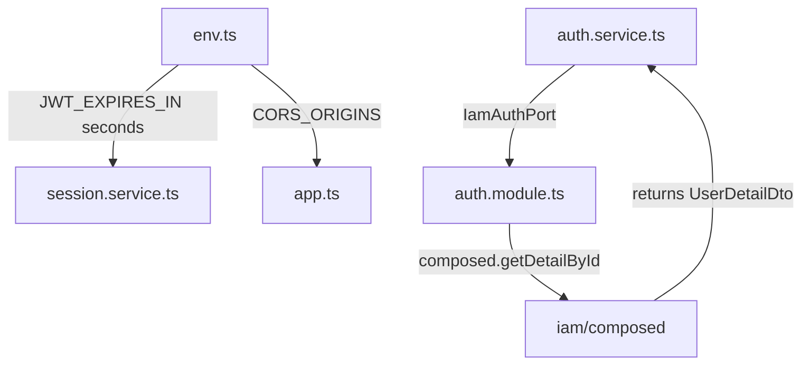

# Technical Design: Server Critical Fixes

## Overview

This design addresses 5 critical/high-priority issues discovered during code review of `apps/server`. Each fix is isolated and can be implemented independently. The issues span type safety, security configuration, token expiration logic, lint compliance, and test compilation.

## Architecture

No architectural changes are required. All fixes are localized to existing modules:

- **Auth module** (`src/modules/auth/`) — type signature corrections
- **Config** (`src/config/env.ts`) — JWT transform fix, CORS env var addition
- **Session module** (`src/modules/session/`) — Date arithmetic fix
- **App bootstrap** (`src/app.ts`) — CORS configuration
- **Various repos/tests** — lint suppression and test mock corrections



## Components and Interfaces

### 1. IamAuthPort Interface Fix (Requirement 1)

**Current state:** `IamAuthPort.getUserDetail` declares return type `Promise<UserDto>`, but the implementation (`deps.iam.composed.getDetailById`) returns `Promise<UserDetailDto>`. `AuthOutputDto` expects `user: UserDetailDto`.

**Change:**

```typescript
// auth.service.ts
import type { UserDetailDto, UserWithPasswordDto } from '@/modules/iam'

export interface IamAuthPort {
  getByIdentifier(identifier: string): Promise<UserWithPasswordDto | undefined>
  getUserDetail(userId: number): Promise<UserDetailDto>  // was: Promise<UserDto>
}

// Method return types also update:
async verifyToken(token: string): Promise<UserDetailDto> { ... }
async handleGetById(userId: number): Promise<UserDetailDto | undefined> { ... }
```

**Why this is safe:** The runtime implementation already returns `UserDetailDto`. The `AuthenticatedUser` interface in `shared/http/auth.ts` is a structural subset of `UserDetailDto` (it only needs `id`, `email`, `username`, `fullname`, `isActive`, audit fields), so the auth plugin continues working via TypeScript's structural typing.

### 2. JWT expiresIn Units Fix (Requirement 2)

**Current state:** `env.ts` transforms `"7d"` → `ms("7d")` → `604800000` (milliseconds). `jwt.sign()` interprets numeric `expiresIn` as **seconds**. Result: tokens live ~19.16 years.

**Change in `config/env.ts`:**

```typescript
JWT_EXPIRES_IN: z
  .string()
  .default('7d')
  .transform((value) => {
    // oxlint-disable-next-line typescript/no-unsafe-type-assertion
    const milliseconds = ms(value as ms.StringValue)
    if (!milliseconds || milliseconds <= 0) {
      throw new Error(`Invalid JWT_EXPIRES_IN value: "${value}" resolves to ${milliseconds}ms`)
    }
    return Math.floor(milliseconds / 1000) // Convert to seconds for jsonwebtoken
  }),
```

**Change in `session.service.ts`:**

```typescript
// expiredAt uses env.JWT_EXPIRES_IN which is now seconds; Date math needs ms
const expiredAt = new Date(createdAt.getTime() + env.JWT_EXPIRES_IN * 1000)
```

The `jwt.sign(data, secret, { expiresIn: env.JWT_EXPIRES_IN })` call remains unchanged since it now correctly receives seconds.

### 3. CORS Policy Restriction (Requirement 3)

**Change in `config/env.ts`** — add new env var:

```typescript
CORS_ORIGINS: z
  .string()
  .optional()
  .transform((v) => v?.split(',').map((s) => s.trim()).filter(Boolean)),
```

**Production validation** — add after `safeParse`:

```typescript
if (_env.data.APP_ENV === 'production' && (!_env.data.CORS_ORIGINS || _env.data.CORS_ORIGINS.length === 0)) {
  console.error('CORS_ORIGINS must be set in production')
  process.exit(1)
}
```

**Change in `app.ts`:**

```typescript
import { env } from '@/config/env'

// Replace .use(cors()) with:
.use(cors({
  origin: env.CORS_ORIGINS ?? true, // true = allow all (dev/test); array = restrict
}))
```

### 4. Lint Error Fixes (Requirement 4)

**4a. `goods-receipt.contract.ts` — `no-underscore-dangle`**

Replace `@ts-ignore` with `@ts-expect-error` and add oxlint-disable:

```typescript
// oxlint-disable-next-line eslint/no-underscore-dangle -- Reserved for future item mutation endpoint
// @ts-expect-error - Used for reference, will be used in future item creation endpoints
const _GoodsReceiptNoteItemMutationDto = z.object({ ... })
```

**4b. Unsafe type assertions in repos**

Add per-line oxlint-disable comments:

```typescript
// oxlint-disable-next-line typescript/no-unsafe-type-assertion -- Drizzle raw SQL result matches contract shape
```

Affected files:
- `src/modules/crm/customer.repo.ts`
- `src/modules/inventory/stock-transaction/stock-transaction.repo.ts`
- `src/modules/reporting/procurement-reporting/procurement-reporting.repo.ts`
- `src/modules/reporting/crm-reporting/crm-reporting.repo.ts`

**4c. `database-helpers.test.ts` — `await-thenable`**

Remove `await` from synchronous helper calls (`eqIf`, `notDeleted` return `SQL | undefined`, not Promises):

```typescript
// Before
expect(await eqIf({} as never, undefined)).toBeUndefined()
// After
expect(eqIf({} as never, undefined)).toBeUndefined()
```

Lines affected: the `eqIf` and `notDeleted` assertions in the "where composition" describe block.

**4d. `stock-summary.service.test.ts` — `no-underscore-dangle`**

The loop variable `_item` triggers the rule. Fix by adding a disable comment:

```typescript
// oxlint-disable-next-line eslint/no-underscore-dangle
for (const _item of data) {
```

### 5. Recipe Service Test TypeScript Error (Requirement 5)

**Current state:** In `FakeRecipeRepo.update()`, spreading `...data` over `...existing` can overwrite `createdAt` with `undefined` because the update payload type doesn't guarantee those fields.

**Fix:** Explicitly preserve audit fields after the spread:

```typescript
async update(id, data, items): Promise<EntityRef | undefined> {
  const existing = this.store.get(id)
  if (!existing) return undefined
  const updated: RecipeDto = {
    ...existing,
    ...data,
    targetQty: data.targetQty?.toString() ?? existing.targetQty,
    instructions: data.instructions ? data.instructions : existing.instructions,
    // Preserve audit fields that data might overwrite with undefined
    createdAt: existing.createdAt,
    updatedAt: existing.updatedAt,
    createdBy: existing.createdBy,
    updatedBy: existing.updatedBy,
    items: items.map((item, idx) => ({ ... })),
  }
  this.store.set(id, updated)
  return { id }
}
```

## Data Models

No data model changes. All fixes are at the interface/configuration level. The underlying database schema, DTOs, and runtime shapes remain unchanged.

## Error Handling

### JWT Validation Enhancement

The `JWT_EXPIRES_IN` transform now validates the parsed value:

```typescript
if (!milliseconds || milliseconds <= 0) {
  throw new Error(`Invalid JWT_EXPIRES_IN value: "${value}" resolves to ${milliseconds}ms`)
}
```

This causes a startup crash (fail-fast) if the env var contains an unparseable or zero/negative duration.

### CORS Production Guard

```typescript
if (_env.data.APP_ENV === 'production' && (!_env.data.CORS_ORIGINS || _env.data.CORS_ORIGINS.length === 0)) {
  console.error('CORS_ORIGINS must be set in production')
  process.exit(1)
}
```

Fail-fast on startup prevents deploying to production without explicit CORS configuration.

## Testing Strategy

Property-based testing is **not applicable** for this feature. These are bug fixes to configuration, type annotations, lint suppressions, and test mocks — none involve pure functions with varying input spaces or universal properties.

**Verification approach:**

| Gate | Command | Validates |
|------|---------|-----------|
| TypeScript compilation | `bun run typecheck` | Requirements 1, 5 |
| Lint | `bun run lint` | Requirement 4 |
| Full verify gate | `bun run verify` | All requirements (lint + typecheck + knip + check-deps) |
| Unit tests | `bun run test` | Requirement 5 (recipe test compiles and runs) |

**Manual verification for Requirement 2:**
- After login, decode the JWT and confirm `exp - iat ≈ 604800` (7 days in seconds)

**Manual verification for Requirement 3:**
- Start app without `CORS_ORIGINS` and `APP_ENV=production` → confirm startup failure
- Start app with `CORS_ORIGINS=https://app.example.com` → confirm only that origin is allowed

## Risks & Mitigations

| Risk | Mitigation |
|------|-----------|
| Existing tokens in production have ~19yr expiry | The `verifySession` method also checks `session.expiredAt` from DB, which was computed with the (also buggy) millisecond value. Both are fixed by this change. Existing sessions should be invalidated on deploy. |
| Changing `IamAuthPort` return type might break consumers | `AuthService` is the sole consumer (verified in `auth.module.ts`). The `AuthenticatedUser` interface is a structural subset of `UserDetailDto`. |
| CORS restriction might block legitimate frontends | `CORS_ORIGINS` accepts comma-separated values for multiple origins. Must be documented in deployment config. |
| Lint disable comments hide real issues | Each disable comment includes a justification explaining why the suppression is acceptable (Drizzle raw SQL shape, reserved future variable). |

## Files to Modify

| File | Change |
|------|--------|
| `src/modules/auth/auth.service.ts` | Update `IamAuthPort` interface, `verifyToken`, `handleGetById` return types to `UserDetailDto` |
| `src/config/env.ts` | Fix `JWT_EXPIRES_IN` transform (ms→sec), add `CORS_ORIGINS`, add production validation |
| `src/modules/session/session.service.ts` | Fix `expiredAt` Date math (`* 1000`) |
| `src/app.ts` | Import `env`, configure CORS with `env.CORS_ORIGINS` |
| `src/modules/purchasing/goods-receipt.contract.ts` | Add oxlint-disable + change `@ts-ignore` → `@ts-expect-error` |
| `src/modules/crm/customer.repo.ts` | Add oxlint-disable for unsafe assertion |
| `src/modules/inventory/stock-transaction/stock-transaction.repo.ts` | Add oxlint-disable for unsafe assertion |
| `src/modules/reporting/procurement-reporting/procurement-reporting.repo.ts` | Add oxlint-disable comments (multiple locations) |
| `src/modules/reporting/crm-reporting/crm-reporting.repo.ts` | Add oxlint-disable for unsafe assertion |
| `src/tests/unit/database-helpers.test.ts` | Remove `await` from 4 synchronous calls |
| `src/tests/unit/stock-summary.service.test.ts` | Add oxlint-disable for loop variable |
| `src/tests/unit/recipe.service.test.ts` | Preserve audit fields in mock `update` to fix `createdAt` type |
