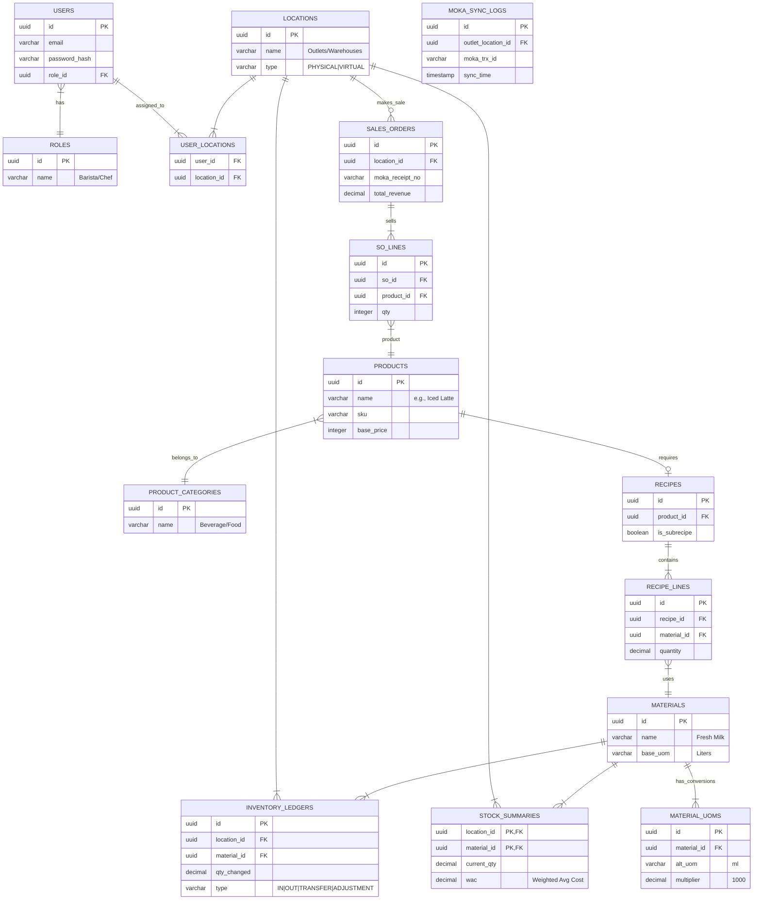

# Ikki ERP Entity-Relationship Diagram (ERD)

This is the conceptual Entity-Relationship Diagram based on the `Ikki Group F&B` feature blueprints. It focuses on the core MVP Phase 1 (Layer 0 to Layer 3).

