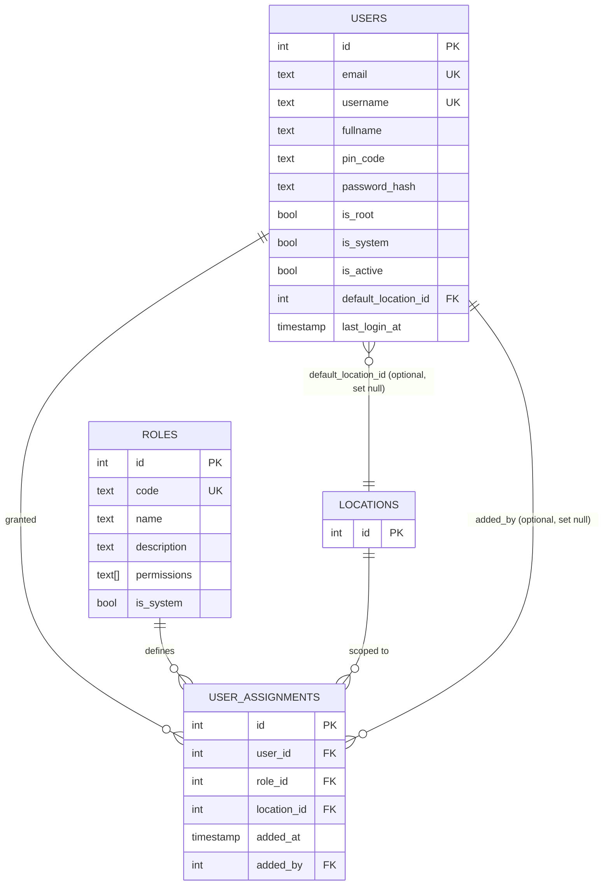
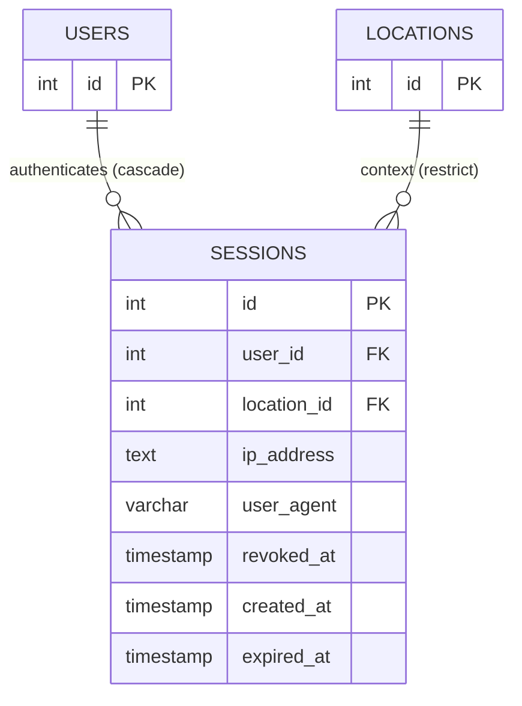
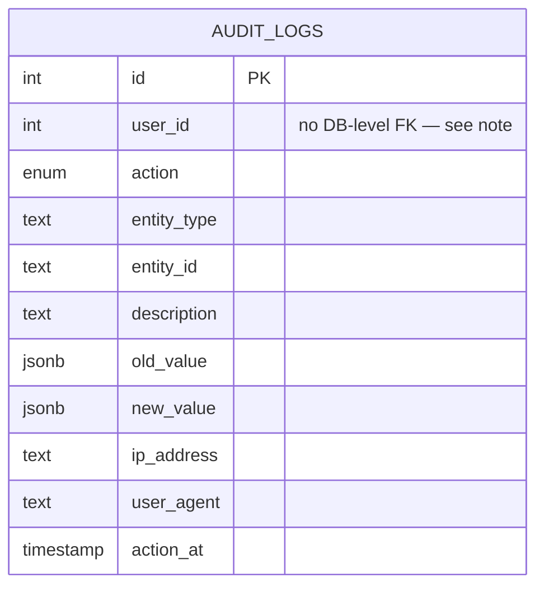

# ERD — Core

Part of [`docs/database/`](./README.md). Covers `audit.ts`, `session.ts`, `iam.ts`.

> Audit columns (`createdAt`/`updatedAt`/`createdBy`/`updatedBy`[/`deletedAt`/`deletedBy`])
> are omitted from attribute lists below for brevity — see
> [conventions](./SCHEMA_CONVENTIONS.md#audit-columns--soft-delete) for which
> bundle each table actually uses. External entities (defined in another
> domain file) are shown with only their `id` — see
> [`02-master-data.md`](./ERD_MASTER_DATA.md) for their full definition.

## `iam.ts` — roles, users, user_assignments

Notes:

- `user_assignments` is the LBAC join table: one row = "this user has this
  role at this location". Unique on `(userId, locationId)` — one role per
  user per location.
- `defaultLocationId` and `addedBy` are both nullable FKs (`onDelete: 'set null'`)
  — drawn as optional above, unlike the three mandatory FKs on `user_assignments`.
- Root users (`isRoot = true`) bypass `user_assignments` entirely at the
  service layer — implicit superadmin on all locations. A row here for a
  root user only exists when that root also needs a specific role somewhere.

## `session.ts` — sessions

Notes:

- No `auditFullColumns` — sessions are high-churn and system-managed, not
  user-mutated, so `createdBy`/`updatedBy` don't apply. Only `createdAt` (no
  `updatedAt` either — sessions are immutable except `revokedAt`).
- `locationId` is required (LBAC permission checks resolve against the
  `(user, location)` pair, not the user alone) — switching locations means
  creating a new session, not updating this one.
- `revokedAt IS NOT NULL` is treated as equivalent to expired by the auth
  layer, but the row is retained (not deleted) for audit purposes.

## `audit.ts` — audit_logs

Notes:

- `userId` is a plain `integer`, **not** a Drizzle `.references()` FK —
  deliberately, so that deleting a user never blocks or cascades into audit
  history. Treat it as a soft reference to `users.id` at the application
  layer only.
- `entityId` is `text`, not `integer` — audit logs describe actions across
  many entity types with different PK types, so the column is untyped by
  design (store `String(id)`).
- No audit columns on this table — it _is_ the audit trail; adding
  `createdBy`/`updatedBy` to it would be circular. Use `actionAt` for
  ordering/filtering.
