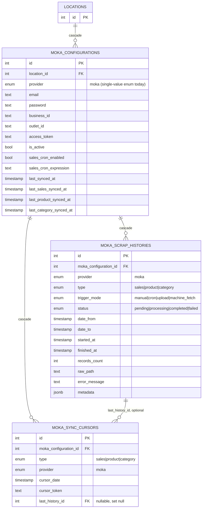

# ERD — Integrations

Part of [`docs/database/`](./README.md). Covers `moka.ts`.

> Audit columns omitted for brevity — see [conventions](./SCHEMA_CONVENTIONS.md#audit-columns--soft-delete).
> External entities are shown with only `id`.

## `moka.ts` — third-party POS sync (Moka)

Notes:

- `provider` is currently a single-value enum (`'moka'` only) on every table
  here — modeled as an enum rather than a hardcoded column specifically so a
  second POS integration can be added later without a column rename, just a
  new enum value.
- `moka_scrap_histories` is the append-only log of each sync run (one row
  per scrape attempt, with status/timing/error); `moka_sync_cursors` is the
  small "where did we leave off" pointer table (one row per
  `(configurationId, type)` pair, upserted) that the next sync run reads
  to resume incrementally instead of re-fetching everything.
- `mokaConfigurations` stores the Moka account **password** in plaintext
  (`password: text('password')`) — this is a third-party credential the app
  needs to replay for scraping, not a user-facing auth credential, but worth
  flagging if this table is ever exposed via an API response without
  explicit field omission.
