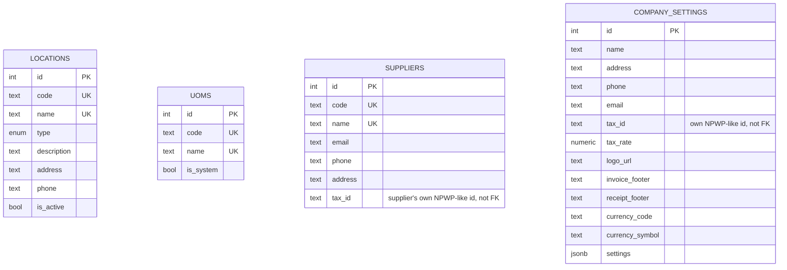
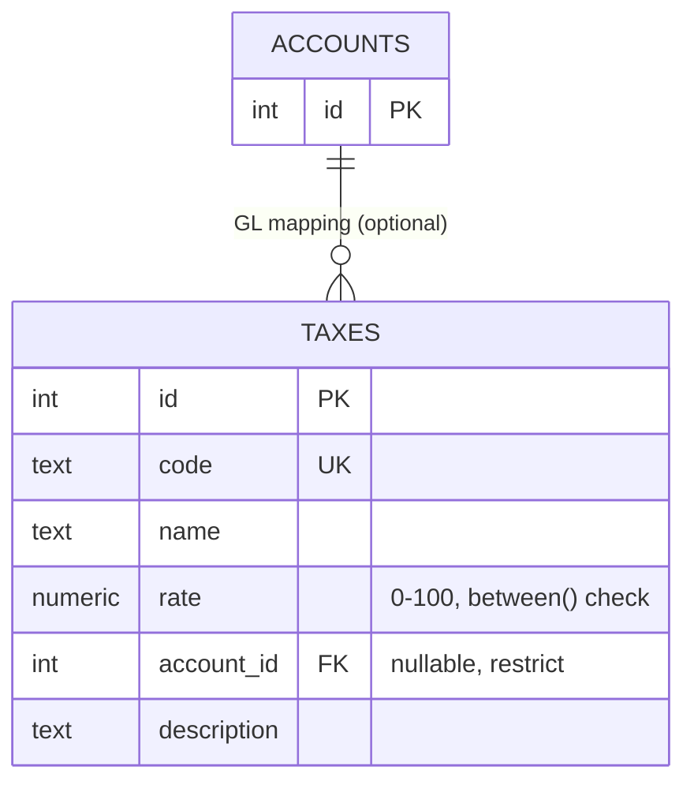
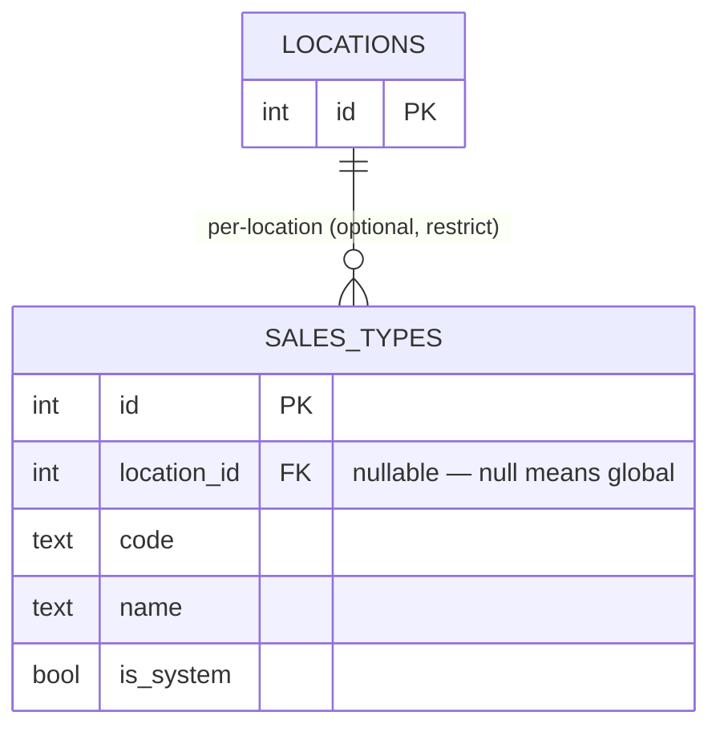
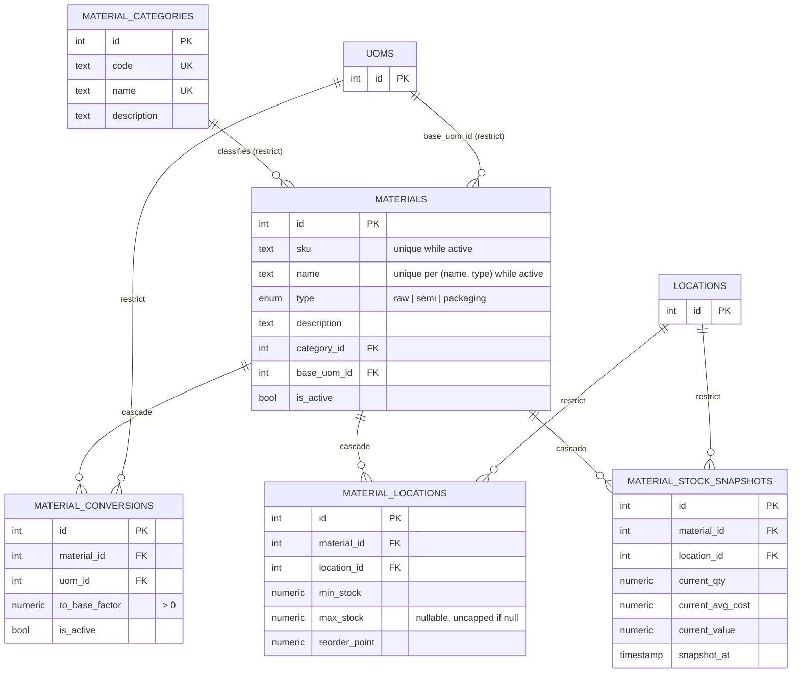
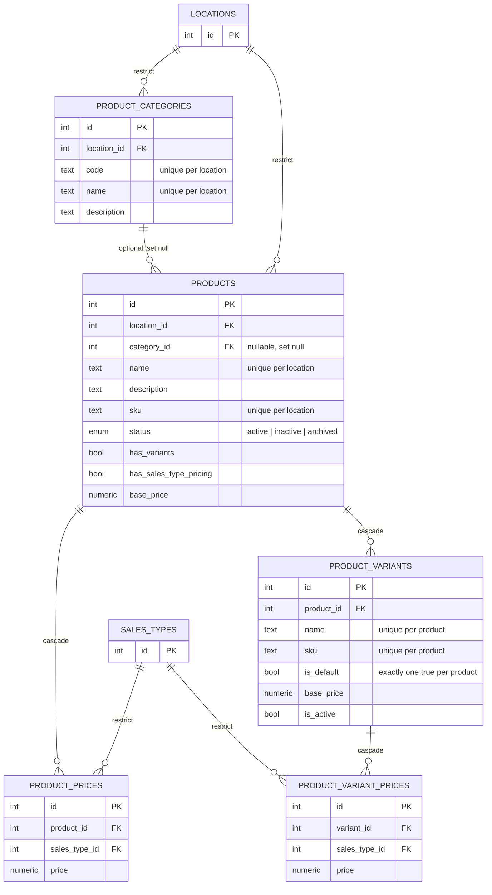

# ERD — Master Data

Part of [`docs/database/`](./README.md). Covers `location.ts`, `uom.ts`,
`tax.ts`, `supplier.ts`, `company.ts`, `sales-type.ts`, `material.ts`, `product.ts`.

> Audit columns omitted for brevity — see [conventions](./SCHEMA_CONVENTIONS.md#audit-columns--soft-delete).
> External entities are shown with only `id`.

## Standalone reference tables — location, uom, supplier, company

No relationships between these four — grouped together only for compactness.
`locations` is the most-referenced table in the entire schema (nearly every
Operations table scopes to a location); `uom`, `supplier`, `company` are
pure leaves.

Notes:
- `locations.code`/`name` are globally unique **forever**, even after
  deactivation — a retired code is never reused (no partial/soft-delete
  exception on this unique index, unlike `suppliers`).
- `company_settings` is a de-facto singleton — the app always reads/writes
  row id 1 (or "the only row"); there's no multi-tenancy concept in this
  table despite having a normal serial PK.
- `suppliers.taxId` and `company_settings.taxId` are plain text fields for
  the entity's own tax ID (NPWP in Indonesia) — unrelated to the `taxes`
  table below, which models tax *rates*, not tax *identities*.

## `tax.ts` — taxes

Notes:
- **Layering exception**: `tax.ts` is Master Data but depends on
  `finance.ts` (Operations) for the GL account mapping — this is a real,
  intentional upward dependency, not an oversight. A tax rate needs to know
  which account it posts to. See
  [`00-overview.md`](./ERD_OVERVIEW.md#domain-dependency-graph).
- No owning module yet — `products.taxId` is commented out in `product.ts`
  pending one. `taxesTable` is fully defined and migration-ready, just
  unused by any repo/service today.

## `sales-type.ts` — sales_types

Notes:
- Two-tier uniqueness via partial indexes: `code`/`name` unique among
  **global** rows (`locationId IS NULL`) and separately unique **within a
  location** (`locationId IS NOT NULL`) — two different locations may both
  have a `'WHOLESALE'` sales type without conflict.
- `check`: `isSystem = true → locationId IS NULL` — seeder-created global
  sales types (`DINE_IN`, `TAKEAWAY`, `DELIVERY`) can never be per-location.

## `material.ts` — categories, materials, conversions, locations, snapshots

Notes:
- **`material_locations` (config) vs `material_stock_snapshots` (projection)**
  is the canonical example of the [cache-friendliness](./SCHEMA_CONVENTIONS.md#cache-friendliness)
  split-by-write-frequency pattern in this schema. Same composite key
  `(materialId, locationId)`, always joined together on read
  (`material-location.repo.ts`), but kept in separate tables so a long cache
  TTL on thresholds doesn't force a long TTL on live stock quantity.
  `material_stock_snapshots` has no audit columns at all — it's rebuilt by
  the inventory event handler, never user-edited.
- `materials.sku` and `(name, type)` use **partial unique indexes**
  (`WHERE is_active = true`) — a discontinued material's SKU can be reused
  by a new one.
- `materialConversionsTable.uomId` must not equal the material's
  `baseUomId` — a service-layer invariant, not DB-enforced (converting a
  base unit to itself is a no-op).

## `product.ts` — categories, products, prices, variants, variant prices

Notes:
- Pricing lookup priority (service-layer logic, not DB-enforced):
  1. Non-variant product: `product_prices` row for the current sales type →
     fall back to `products.basePrice`.
  2. Variant product: `product_variant_prices` row for
     `(variantId, salesTypeId)` → fall back to `product_variants.basePrice`.
  `hasVariants`/`hasSalesTypePricing` flags on `products` select which path
  applies; both flag combinations are valid, enforced at the service layer.
- `productCategoriesTable` and `productsTable` are **per-location** — a
  category belongs to exactly one location, and a product must reference a
  category from the *same* location. Drizzle can't express that composite
  FK, so it's enforced by a Postgres trigger (see the comment in
  `product.ts` for the migration file reference), not a `check()` constraint.
- `taxId` on `products` is commented out — depends on `tax.ts` gaining an
  owning module first.
