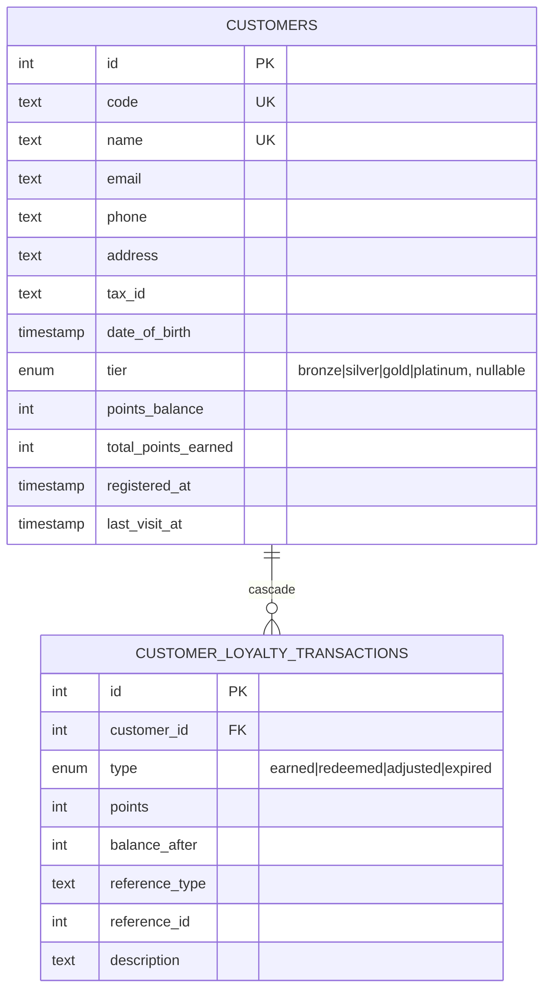
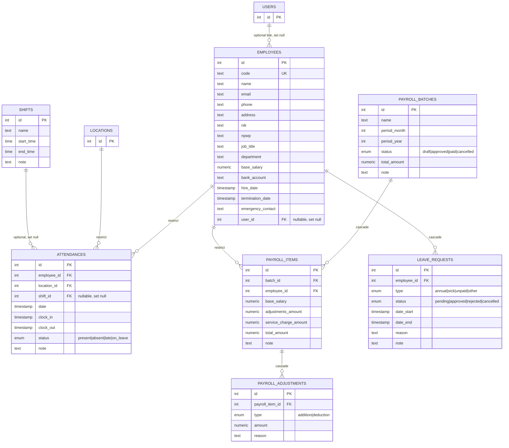
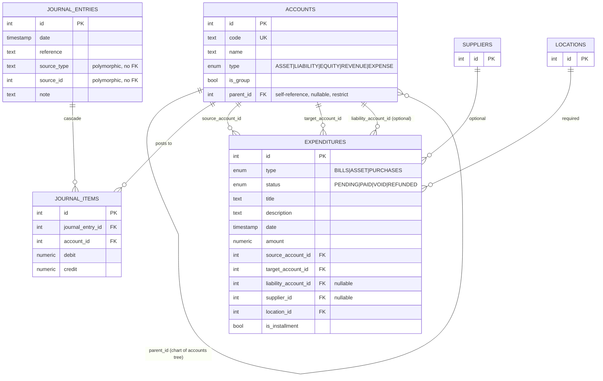
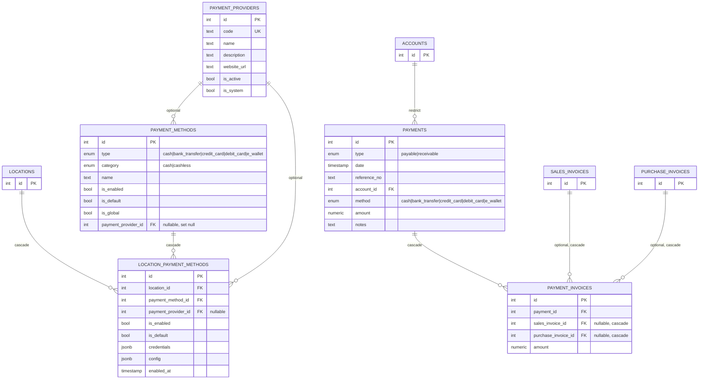
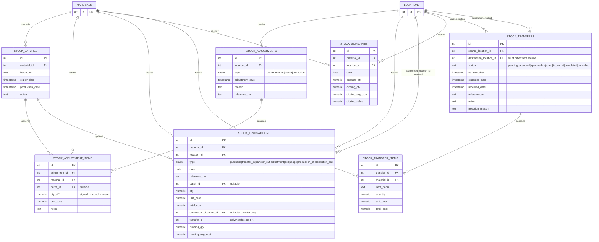
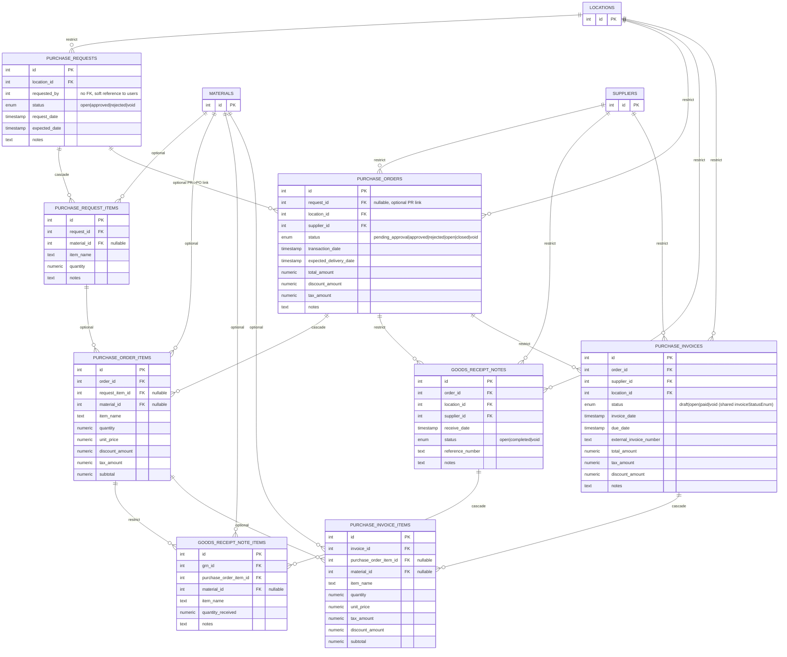
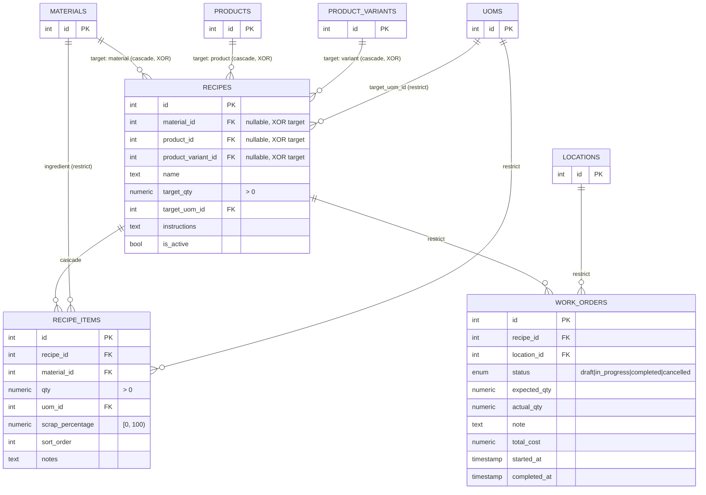
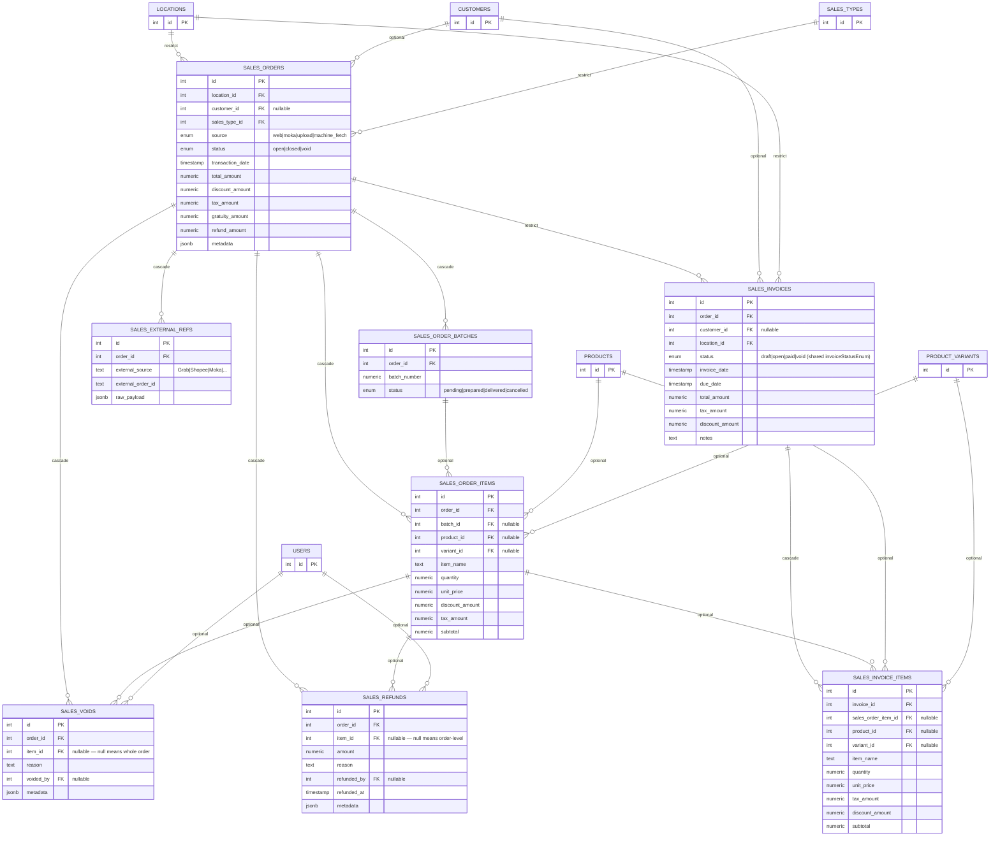

# ERD — Operations

Part of [`docs/database/`](./README.md). Covers `crm.ts`, `hr.ts`,
`finance.ts`, `payment.ts`, `inventory.ts`, `purchasing.ts`, `production.ts`,
`recipe.ts`, `sales.ts`.

> Audit columns omitted for brevity — see [conventions](./SCHEMA_CONVENTIONS.md#audit-columns--soft-delete).
> External entities are shown with only `id`.

## `crm.ts` — customers, customer_loyalty_transactions

Notes:

- `pointsBalance` on `customers` is a denormalized running total;
  `customer_loyalty_transactions.balanceAfter` is the append-only audit
  trail it was derived from — see [cache-friendliness](./SCHEMA_CONVENTIONS.md#cache-friendliness).
- File is named `crm.ts` (not `customer.ts`) to match the owning module
  `modules/crm/` — table export names (`customersTable`, ...) are unchanged.

## `hr.ts` — employees, shifts, attendances, payroll, leave requests

Notes:

- `shiftsTable`/`attendancesTable` correspond to the `modules/hr/hr`
  submodule (an unfortunately generic submodule name — flagged as a
  candidate rename, not yet done).
- `employees.userId` links an employee record to a system login (`users`) —
  optional; not every employee needs system access, and not every user is
  an employee (e.g. root/system accounts).

## `finance.ts` — accounts, journal entries, expenditures

Notes:

- `journalEntries.sourceType`/`sourceId` is a polymorphic soft-reference
  (`'sales'`, `'payroll'`, `'purchasing'`, `'production'`, ...) — deliberately
  not a real FK since it can point at rows in any of several tables.
- `expenditures` has **three** account FKs modeling a double/triple-entry-ish
  flow: `sourceAccountId` (where the money comes from — cash/bank),
  `targetAccountId` (where it goes — asset/expense category), optional
  `liabilityAccountId` (for tracking debt/hutang on installment purchases).
- All four expenditure FK columns got dedicated indexes in the last schema
  review — none were covered by an existing composite index, and GL
  drill-down by account/supplier is a common reporting query.

## `payment.ts` — providers, methods, settlement

Notes:

- **Three distinct concepts, easy to conflate**: `payment_methods`
  (which method _types_ are configured — cash, bank transfer, ...),
  `location_payment_methods` (which of those are _enabled per store_, with
  store-specific credentials), `payments`/`payment_invoices` (the actual
  money _movement_ — AR/AP settlement). These used to be split across
  `finance_payment.ts` + 3 other files with `payments` mis-grouped under
  "finance" — fixed during the schema reorganization; owner is
  `modules/payment/payment`, not `modules/finance`.
- `payment_invoices` is the allocation line: one payment can be split across
  multiple invoices (partial payments), and one invoice can receive multiple
  payments over time (installments) — hence the separate join table rather
  than a direct FK on the invoice.

## `inventory.ts` — batches, adjustments, transactions, summaries, transfers

Notes:

- `stockTransactions` is the append-only event log; `stockSummaries` is the
  daily-rollup projection; `material.materialStockSnapshots` (see
  [`02-master-data.md`](./ERD_MASTER_DATA.md)) is the current-state
  projection. Three different granularities of the same underlying stock
  movement facts — this is intentional, not duplication: event log for
  audit/recompute, daily summary for reporting, live snapshot for
  fast "how much do we have right now" reads.
- `stockTransactions.transferId` is a plain `integer`, **not** an FK to
  `stock_transfers.id` — same polymorphic-soft-reference pattern as
  `journalEntries.sourceId`.
- `stockBatchesTable` (lot/expiry tracking) is schema-complete but has zero
  reads/writes from any repo/service today — same "ahead of the module
  layer" situation as the unimplemented `purchasing.ts` tables below.

## `purchasing.ts` — request → order → receipt → invoice

Notes:

- **⚠ Two of four lifecycle stages are schema-only**: `purchase_requests`/
  `purchase_request_items` (PR stage) and `purchase_invoices`/
  `purchase_invoice_items` (AP invoicing stage) have no repo/service
  implementing them — only Order and Goods Receipt are wired up
  (`purchase-order.repo.ts`, `goods-receipt.repo.ts`). The FKs exist because
  dropping them later would be a breaking schema change for no benefit; just
  don't build against those two tables until the modules layer catches up.
- `invoiceStatusEnum` is shared with `sales.ts`'s `sales_invoices` (defined
  once in `_enums.ts`) — same document lifecycle, opposite sides of the
  ledger (payable vs receivable).

## `production.ts` + `recipe.ts` — work orders & bill of materials

Notes:

- `recipes` target is **XOR**-enforced: exactly one of `materialId`/
  `productId`/`productVariantId` is set. DB-enforced via a `check()` built
  from `and`/`or`/`isNull`/`isNotNull` combinations (no `CASE WHEN`
  arithmetic — see [conventions](./SCHEMA_CONVENTIONS.md#constraints--query-builder-only-never-raw-sql)),
  plus three partial unique indexes (one recipe per target).
- Variant-level recipes take priority over product-level ones when both
  exist for the same product (service-layer lookup order, not DB-enforced):
  variant recipe → product recipe → none.
- `recipeItems.uomId` may differ from the ingredient material's own
  `baseUomId` (e.g. recipe calls for grams, material's base unit is kg) —
  resolved via `material_conversions` at cost-calculation time.

## `sales.ts` — orders → voids/refunds → invoices

Notes:

- Owned by two submodules: `modules/sales/sales-order` (everything except
  invoices) and `modules/sales/sales-invoice` (`sales_invoices`,
  `sales_invoice_items`).
- `sales_order_items`/`sales_invoice_items` store `productId`/`variantId` as
  **nullable** — custom/ad-hoc line items (not tied to the product catalog)
  are supported, alongside `itemName` always being stored immutably even
  when a product link exists (so renaming a product later doesn't rewrite
  history).
- `sales_orders.salesTypeId` gained a dedicated index in the last schema
  review — it's a common reporting dimension (e.g. Dine-in vs Delivery
  revenue split) that had no index at all before.
