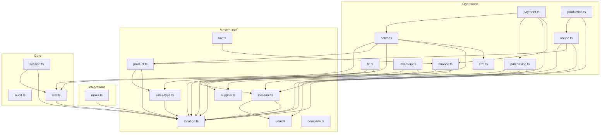

# ERD — Overview & Domain Dependency Graph

Part of [`docs/database/`](./README.md). This file shows how the 21 schema
files relate to each other (which one imports which), *not* individual
table columns — see the layer files for actual entity diagrams:

- [`01-core.md`](./ERD_CORE.md)
- [`02-master-data.md`](./ERD_MASTER_DATA.md)
- [`03-operations.md`](./ERD_OPERATIONS.md)
- [`04-integrations.md`](./ERD_INTEGRATIONS.md)

## Domain dependency graph

Arrows point from "imports tables from" → "the file it imports". Read: if
there's an arrow `sales.ts → crm.ts`, then `sales.ts` imports `customersTable`
from `crm.ts`. This is the graph you must not create a cycle in — see
[Layering / import direction](./SCHEMA_CONVENTIONS.md#layering--import-direction).

Notable things this graph makes visible:

- **`payment.ts` is the most-connected Operations file** — it depends on
  `finance` (GL account for settlement), `purchasing` and `sales` (invoice
  FKs for payment allocation). This is intentional: `payments`/`payment_invoices`
  used to live in a `finance_payment.ts` file, which was a mis-grouping fixed
  during the last schema reorganization — the real owning module is
  `modules/payment/payment`, not finance.
- **`tax.ts` depends on `finance.ts`** (GL account mapping for tax liability)
  despite `tax.ts` having no owning module yet (see the `⚠` in its file
  header). The dependency is legitimate regardless — a tax rule needs to know
  which account it posts to.
- **`recipe.ts` bridges Master Data and a `productsTable`/`materialsTable`
  target** — a recipe's output is *either* a material or a product/variant
  (XOR-enforced), which is why it depends on both `material.ts` and
  `product.ts`.
- **No cycles.** If you're about to add an import that would create one
  (e.g. `material.ts` importing from `inventory.ts`), that's a signal the
  new column/table belongs in a different file, not a reason to restructure
  this graph.

## Table count by domain

| Domain file | Tables | Notes |
|---|---|---|
| `audit.ts` | 1 | |
| `session.ts` | 1 | |
| `iam.ts` | 3 | |
| `location.ts` | 1 | |
| `uom.ts` | 1 | |
| `tax.ts` | 1 | No owning module yet |
| `supplier.ts` | 1 | |
| `company.ts` | 1 | |
| `sales-type.ts` | 1 | |
| `material.ts` | 5 | |
| `product.ts` | 5 | |
| `crm.ts` | 2 | |
| `hr.ts` | 7 | |
| `finance.ts` | 4 | |
| `payment.ts` | 5 | |
| `inventory.ts` | 7 | |
| `purchasing.ts` | 8 | 4 tables unimplemented (see `⚠` comments) |
| `production.ts` | 1 | |
| `recipe.ts` | 2 | |
| `sales.ts` | 8 | |
| `moka.ts` | 3 | |
| **Total** | **~68** | |
