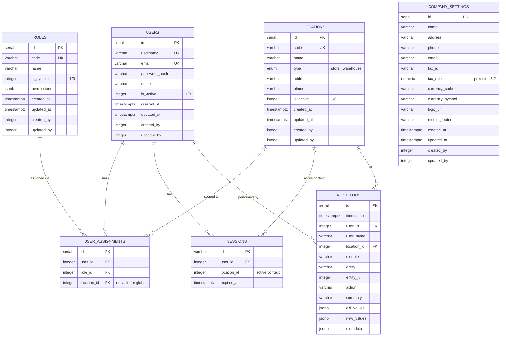

# ERD: Core

Locations, IAM, Sessions, Company Settings, Audit Logs.

## Mermaid



## Diagram

```
[locations]
  PK id serial
  UK code varchar(50)
  -- name varchar(255)
  -- type enum (store/warehouse)
  -- address varchar(500)
  -- phone varchar(50)
  -- is_active integer (1/0), default 1
  -- audit stamps


[roles]                          [users]
  PK id serial                     PK id serial
  UK code varchar(50)              UK username varchar(100)
  -- name varchar(255)             UK email varchar(255)
  -- is_system integer (1/0)       -- password_hash varchar(500)
  -- permissions jsonb             -- name varchar(255)
  -- audit stamps                  -- is_active integer (1/0), default 1
                                   -- audit stamps

        [user_assignments]
          PK id serial
          FK user_id ────── users (CASCADE)
          FK role_id ────── roles (RESTRICT)
          FK location_id - - → locations (SET NULL, nullable for global)
          UK (user_id, role_id, location_id)


[sessions]
  PK id varchar(255) (token string)
  FK user_id ────── users (CASCADE)
  -- location_id integer (active context)
  -- expires_at timestamptz


[company_settings]
  PK id serial (singleton = 1)
  -- name varchar(255)
  -- address varchar(500)
  -- phone varchar(50)
  -- email varchar(255)
  -- tax_id varchar(100)
  -- tax_rate numeric(5,2), default '0'
  -- currency_code varchar(10), default 'IDR'
  -- currency_symbol varchar(10), default 'Rp'
  -- logo_url varchar(500)
  -- receipt_footer varchar(1000)
  -- audit stamps


[audit_logs]
  PK id serial
  -- timestamp timestamptz, default now()
  FK user_id ────── users (RESTRICT)
  -- user_name varchar(255)
  FK location_id - - → locations (SET NULL)
  -- module varchar(50)
  -- entity varchar(50)
  -- entity_id integer
  -- action varchar(20)
  -- summary varchar(500)
  -- old_values jsonb
  -- new_values jsonb
  -- metadata jsonb
  IDX (timestamp)
  IDX (entity, entity_id)
  IDX (user_id, timestamp)
  IDX (module, timestamp)
```

## Audit Stamps

All tables with "audit stamps" include:

| Column       | Type        | Notes               |
| ------------ | ----------- | ------------------- |
| `created_at` | timestamptz | default `now()`     |
| `updated_at` | timestamptz | default `now()`     |
| `created_by` | integer     | nullable FK → users |
| `updated_by` | integer     | nullable FK → users |

## Notes

- `locations.type` is a pg enum (`location_type`). Determines available features (store=POS+menu+inventory, warehouse=inventory only).
- `locations.is_active` uses integer (1/0), not native boolean — consistent across all tables.
- `user_assignments.location_id` nullable — global roles (owner, accountant) have null.
- `sessions.location_id` stores active context switcher state.
- `sessions.id` is a varchar PK (token string), not serial.
- `audit_logs` is append-only. Indexes optimize by timestamp, entity, user, and module lookups.

---

**Next:** [master-data.md](./master-data.md) — Materials, UoM, Suppliers.
