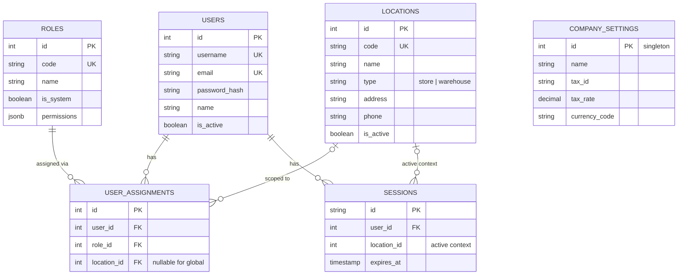

# ERD: Core

Locations, IAM, Sessions, Company Settings.

## Mermaid



[Open/Edit diagram](https://l.mermaid.ai/xvVCay)

## Diagram

```
[locations]
  PK id
  UK code
  -- name
  -- type (store/warehouse)
  -- address, phone
  -- is_active
  -- audit stamps


[roles]                          [users]
  PK id                            PK id
  UK code                          UK username
  -- name                          UK email
  -- is_system                     -- password_hash
  -- permissions jsonb             -- name
  -- audit stamps                  -- is_active
                                   -- audit stamps

        [user_assignments]
          PK id
          FK user_id ────── users
          FK role_id ────── roles
          FK location_id - - → locations (nullable for global roles)
          UK (user_id, role_id, location_id)


[sessions]
  PK id (token string)
  FK user_id ────── users
  -- location_id (active context)
  -- expires_at


[company_settings]
  PK id (singleton = 1)
  -- name, address, phone, email
  -- tax_id, tax_rate
  -- currency_code, currency_symbol
  -- logo_url, receipt_footer
```

## Notes

- `locations.type` determines available features (store=POS+menu+inventory, warehouse=inventory only).
- `user_assignments.location_id` nullable — global roles (owner, accountant) have null.
- `sessions.location_id` stores active context switcher state.

---

**Next:** [master-data.md](./master-data.md) — Materials, UoM, Suppliers.
