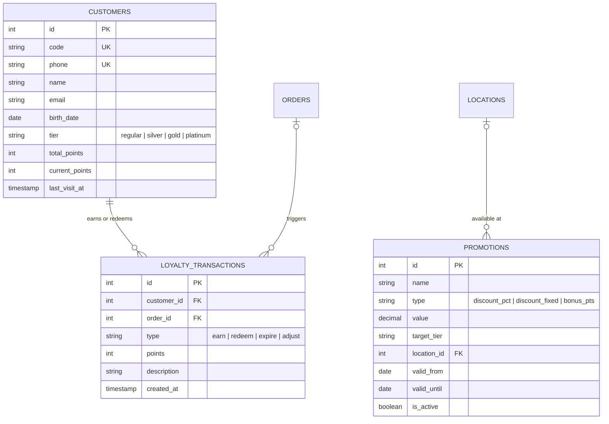

# ERD: CRM

Customers, Loyalty, Promotions.

## Mermaid



[Open/Edit diagram](https://l.mermaid.ai/Ltt3eG)

## Diagram

```
[customers]
  PK id
  UK code
  UK phone
  -- name
  -- email, birth_date
  -- tier (regular/silver/gold/platinum)
  -- total_points, current_points
  -- registered_at, last_visit_at
  -- notes
  -- audit stamps


[loyalty_transactions]
  PK id
  FK customer_id ────── customers
  FK order_id - - → orders (nullable)
  -- type (earn/redeem/expire/adjust)
  -- points integer
  -- description
  -- created_at


[promotions]
  PK id
  -- name, description
  -- type (discount_percentage/discount_fixed/bonus_points/free_item)
  -- value numeric(18,2)
  -- target_tier nullable
  FK location_id - - → locations (nullable = all)
  -- valid_from, valid_until
  -- is_active
  -- audit stamps
```

## Notes

- `customers.phone` is the POS lookup key.
- `loyalty_transactions` is append-only (full points history).
- `promotions.location_id` null = applies to all locations.
- Tier auto-recalculated from `total_points` on each earn.

---

**Next:** [../readme.md](../readme.md) — Back to database index.
