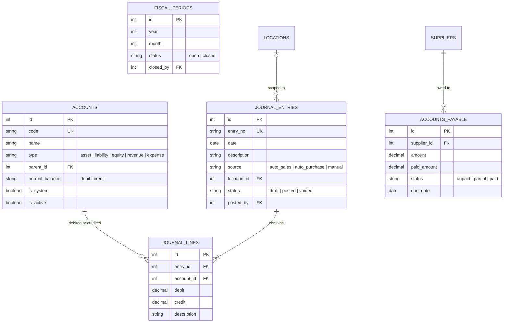

# ERD: Finance

Chart of Accounts, Journal Entries, Accounts Payable, Fiscal Periods.

## Mermaid



[Open/Edit diagram](https://l.mermaid.ai/58G5hj)

## Diagram

```
[accounts]
  PK id
  UK code
  -- name
  -- type (asset/liability/equity/revenue/expense)
  FK parent_id - - → self
  -- normal_balance (debit/credit)
  -- is_system
  -- is_active
  -- audit stamps


[journal_entries]                [journal_lines]
  PK id                            PK id
  UK entry_no                      FK entry_id ── journal_entries (CASCADE)
  -- date                          FK account_id ── accounts
  -- description                   -- debit numeric(18,2)
  -- source (auto_sales/           -- credit numeric(18,2)
       auto_purchase/auto_payroll/ -- description
       manual)
  -- reference_type, reference_id
  FK location_id - - → locations
  -- status (draft/posted/voided)
  FK posted_by - - → users
  -- posted_at
  -- audit stamps


[accounts_payable]
  PK id
  FK supplier_id ────── suppliers
  -- reference_type, reference_id
  -- amount numeric(18,2)
  -- paid_amount numeric(18,2)
  -- status (unpaid/partial/paid)
  -- due_date
  -- paid_at
  -- audit stamps


[fiscal_periods]
  PK id
  -- year, month
  -- status (open/closed)
  FK closed_by - - → users
  -- closed_at
  UK (year, month)
```

## Notes

- `journal_lines`: CHECK NOT (debit > 0 AND credit > 0) per line.
- App-level CHECK: sum(debit) = sum(credit) per entry.
- Posted entries are immutable. Void creates a reversing entry.
- Auto-journals skip `draft` → created directly as `posted`.
- `accounts_payable` created automatically on credit purchases.

---

**Next:** [hr.md](./hr.md) — Employees, Attendance, Payroll.
