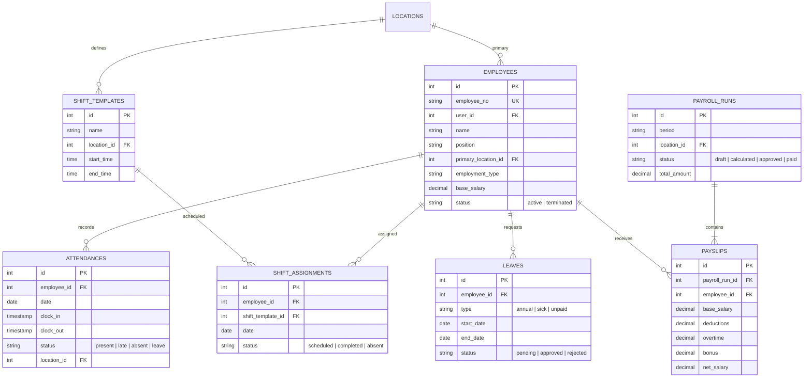

# ERD: HR

Employees, Shift Scheduling, Attendance, Payroll, Leave.

## Mermaid



[Open/Edit diagram](https://l.mermaid.ai/9aFv2W)

## Diagram

```
[employees]
  PK id
  UK employee_no
  FK user_id - - → users (nullable)
  -- name, phone, email
  -- position
  FK primary_location_id ── locations
  -- employment_type (full_time/part_time/contract)
  -- join_date, end_date
  -- base_salary numeric(18,2)
  -- bank_name, bank_account
  -- status (active/inactive/terminated)
  -- audit stamps


[shift_templates]
  PK id
  -- name
  FK location_id ────── locations
  -- start_time, end_time
  -- is_active


[shift_assignments]
  PK id
  FK employee_id ────── employees
  FK shift_template_id ── shift_templates
  -- date
  -- status (scheduled/completed/absent/swapped)
  UK (employee_id, date)


[attendances]
  PK id
  FK employee_id ────── employees
  -- date
  -- clock_in, clock_out
  -- status (present/late/absent/leave/sick)
  FK location_id ────── locations
  -- notes
  FK shift_assignment_id - - → shift_assignments
  UK (employee_id, date)


[payroll_runs]                   [payslips]
  PK id                            PK id
  -- period (YYYY-MM)              FK payroll_run_id ── payroll_runs (CASCADE)
  FK location_id - - → locations   FK employee_id ────── employees
  -- status (draft/calculated/     -- base_salary, working_days,
       approved/paid)                 attendance_days, late_days,
  FK calculated_by ── users           absent_days, deductions,
  FK approved_by - - → users         overtime, allowances, bonus,
  -- paid_at, total_amount            net_salary numeric(18,2)
  -- audit stamps


[leaves]
  PK id
  FK employee_id ────── employees
  -- type (annual/sick/unpaid/other)
  -- start_date, end_date
  -- status (pending/approved/rejected)
  FK approved_by - - → users
  -- reason
  -- audit stamps
```

## Notes

- `employees.user_id` nullable — not all staff need system access.
- `shift_assignments` unique on (employee_id, date) prevents double-booking.
- Shift assignments can be at any location (not just primary).
- Payslip amounts frozen after approval.
- Approved leave auto-creates attendance records.

---

**Next:** [crm.md](./crm.md) — Customers, Loyalty.
