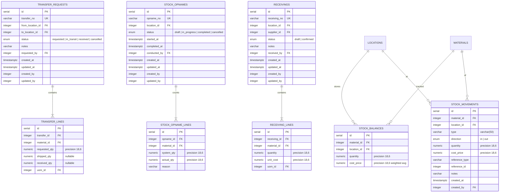

# ERD: Inventory

Stock Balances, Movements, Transfer Requests, Opname, Receiving.

## Mermaid



## Diagram

```
[stock_balances]
  PK id serial
  FK material_id ────── materials (RESTRICT)
  FK location_id ────── locations (RESTRICT)
  -- quantity numeric(18,6), default '0'
  -- cost_price numeric(18,6), default '0' (weighted avg per location)
  UK (material_id, location_id)
  CHECK quantity >= 0
  IDX (material_id)
  IDX (location_id)


[stock_movements]
  PK id serial
  FK material_id ────── materials (RESTRICT)
  FK location_id ────── locations (RESTRICT)
  -- type varchar(50) (receiving/transfer_in/transfer_out/sale/
       adjustment_in/adjustment_out/opname/production_in/production_out)
  -- direction enum (in/out)
  -- quantity numeric(18,6)
  -- cost_price numeric(18,6)
  -- reference_type varchar(50)
  -- reference_id integer
  -- notes varchar(1000)
  -- created_at timestamptz, default now()
  FK created_by - - → users (SET NULL)
  IDX (material_id, location_id, created_at)
  IDX (material_id)
  IDX (location_id)
  IDX (created_by)


[transfer_requests]              [transfer_lines]
  PK id serial                     PK id serial
  UK transfer_no varchar(100)      FK transfer_id ── transfer_requests (CASCADE)
  FK from_location_id ── locations FK material_id ── materials (RESTRICT)
       (RESTRICT)                  -- requested_qty numeric(18,6)
  FK to_location_id ──── locations -- shipped_qty numeric(18,6) nullable
       (RESTRICT)                  -- received_qty numeric(18,6) nullable
  -- status enum (requested/       FK uom_id ────── uoms (RESTRICT)
       in_transit/received/        IDX (transfer_id)
       cancelled)                  IDX (material_id)
  -- notes varchar(1000)           IDX (uom_id)
  FK requested_by - - → users
       (SET NULL)
  -- audit stamps
  CHECK from_location_id != to_location_id
  IDX (from_location_id)
  IDX (to_location_id)
  IDX (requested_by)


[stock_opnames]                  [stock_opname_lines]
  PK id serial                     PK id serial
  UK opname_no varchar(100)        FK opname_id ── stock_opnames (CASCADE)
  FK location_id ────── locations  FK material_id ── materials (RESTRICT)
       (RESTRICT)                  -- system_qty numeric(18,6)
  -- status enum (draft/           -- actual_qty numeric(18,6)
       in_progress/completed/      -- reason varchar(500)
       cancelled)                  IDX (opname_id)
  -- started_at timestamptz        IDX (material_id)
  -- completed_at timestamptz
  FK conducted_by - - → users
       (SET NULL)
  -- audit stamps
  IDX (location_id)
  IDX (conducted_by)


[receivings]                     [receiving_lines]
  PK id serial                     PK id serial
  UK receiving_no varchar(100)     FK receiving_id ── receivings (CASCADE)
  FK location_id ────── locations  FK material_id ─── materials (RESTRICT)
       (RESTRICT)                  -- quantity numeric(18,6)
  FK supplier_id ────── suppliers  -- unit_cost numeric(18,6)
       (RESTRICT)                  FK uom_id ────────── uoms (RESTRICT)
  -- status enum (draft/           IDX (receiving_id)
       confirmed)                  IDX (material_id)
  -- notes varchar(1000)           IDX (uom_id)
  FK received_by - - → users
       (SET NULL)
  -- audit stamps
  IDX (location_id)
  IDX (supplier_id)
  IDX (received_by)
```

## Notes

- `stock_balances` has CHECK qty >= 0. One record per material per location. `cost_price` is the weighted average cost in base UoM for that location.
- `stock_movements` are immutable (append-only audit trail). No audit stamps — only `created_at`/`created_by`.
- `stock_movements.type` is **varchar(50)**, not a pg enum. Known values: `receiving`, `transfer_in`, `transfer_out`, `sale`, `adjustment_in`, `adjustment_out`, `opname`, `production_in`, `production_out`.
- `stock_movements.direction` is a pg enum: `in` or `out`.
- `transfer_requests` has a CHECK constraint ensuring `from_location_id != to_location_id`.
- `receivings.status` is a pg enum with values `draft` and `confirmed`.
- `stock_opname_lines.reason` stores the explanation for any discrepancy.
- `receivings` trigger: stock movement + balance update + cost recalc.

---

**Next:** [production.md](./production.md) — Production Recipes, Production Orders.
