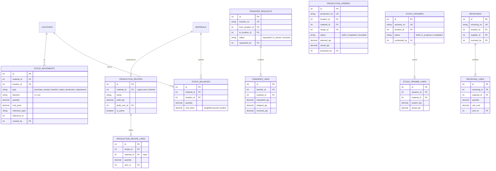

# ERD: Inventory

Stock Balances, Movements, Transfer Requests, Opname, Receiving, Production.

## Mermaid



[Open/Edit diagram](https://l.mermaid.ai/JTM44m)

## Diagram

```
[stock_balances]
  PK id
  FK material_id ────── materials
  FK location_id ────── locations
  -- quantity numeric(18,6)
  UK (material_id, location_id)


[stock_movements]
  PK id
  FK material_id ────── materials
  FK location_id ────── locations
  -- type (purchase_receipt/transfer_in/transfer_out/sales/
       adjustment_in/adjustment_out/return_in)
  -- direction (in/out)
  -- quantity numeric(18,6)
  -- cost_price numeric(18,6)
  -- reference_type, reference_id
  -- notes
  -- created_at
  FK created_by ────── users


[transfer_requests]              [transfer_lines]
  PK id                            PK id
  UK transfer_no                   FK transfer_id ── transfer_requests (CASCADE)
  FK from_location_id ── locations FK material_id ── materials
  FK to_location_id ──── locations -- requested_qty numeric(18,6)
  -- status (requested/in_transit/ -- shipped_qty numeric(18,6)?
       received/cancelled)         -- received_qty numeric(18,6)?
  FK requested_by ────── users     FK uom_id ────── uoms
  -- notes
  -- audit stamps


[stock_opnames]                  [stock_opname_lines]
  PK id                            PK id
  UK opname_no                     FK opname_id ── stock_opnames (CASCADE)
  FK location_id ────── locations  FK material_id ── materials
  -- status (draft/in_progress/    -- system_qty numeric(18,6)
       completed/cancelled)        -- actual_qty numeric(18,6)
  -- started_at, completed_at      -- reason
  FK conducted_by ────── users
  -- audit stamps


[receivings]                     [receiving_lines]
  PK id                            PK id
  FK location_id ────── locations  FK receiving_id ── receivings (CASCADE)
  FK supplier_id - - → suppliers   FK material_id ─── materials
  FK received_by ────── users      -- quantity numeric(18,6)
  -- notes                         -- unit_cost numeric(18,6)
  -- created_at                    FK uom_id ────────── uoms (purchase UoM)
```

## Notes

- `stock_balances` has CHECK qty >= 0. One record per material per location.
- `stock_movements` are immutable (append-only audit trail).
- `transfer_requests` no approval — requested → in_transit → received.
- `receivings` trigger: stock movement + balance update + cost recalc + journal.

---

**Next:** [finance.md](./finance.md) — CoA, Journals, AP.
