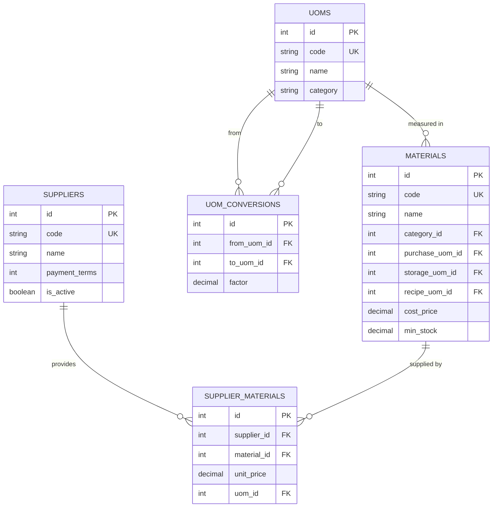

# ERD: Master Data

Materials, UoM (chain), Suppliers. All global (not scoped to location).

## Mermaid



[Open/Edit diagram](https://l.mermaid.ai/BgXScj)

## Diagram

```
[material_categories]
  PK id
  -- name


[materials]
  PK id
  UK code
  -- name
  FK category_id - - → material_categories
  FK purchase_uom_id ────── uoms
  FK storage_uom_id ─────── uoms
  FK recipe_uom_id ──────── uoms
  -- cost_price numeric(18,6)
  -- min_stock numeric(18,6) nullable
  -- audit stamps


[uoms]                           [uom_conversions]
  PK id                            PK id
  UK code                          FK from_uom_id ────── uoms
  -- name                          FK to_uom_id ──────── uoms
  -- category (weight/volume/      -- factor numeric(18,6)
       quantity/length)            UK (from_uom_id, to_uom_id)


[suppliers]                      [supplier_materials]
  PK id                            PK id
  UK code                          FK supplier_id ────── suppliers
  -- name                          FK material_id ───── materials
  -- contact_person                -- unit_price numeric(18,2)
  -- phone, email, address         FK uom_id ────────── uoms
  -- payment_terms integer?        -- min_order_qty numeric(18,6)?
  -- is_active                     UK (supplier_id, material_id)
  -- audit stamps
```

## UoM Chain

Conversions form a directed graph within a category:

```
Karton ──(×12)──→ Liter ──(×1000)──→ Mililiter
Sak ──(×50)──→ Kilogram ──(×1000)──→ Gram
```

Resolution traverses the chain (max 5 hops). Inverse = divide by factor.

## Notes

- Materials have 3 UoM references: purchase, storage, recipe.
- `cost_price` is weighted average in storage UoM.
- `uom_conversions` only valid within same category.

---

**Next:** [menu.md](./menu.md) — Menu Items, Modifiers, Recipes.
