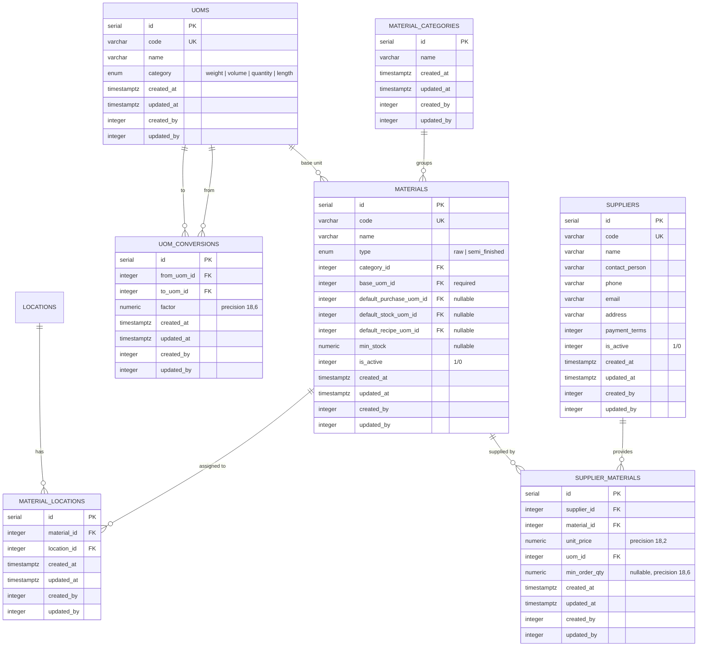

# ERD: Master Data

Materials, UoM (chain), Suppliers. All global (not scoped to location).

## Mermaid



## Diagram

```
[material_categories]
  PK id serial
  -- name varchar(255)
  -- audit stamps


[materials]
  PK id serial
  UK code varchar(50)
  -- name varchar(255)
  -- type enum (raw/semi_finished)
  FK category_id - - → material_categories (SET NULL)
  FK base_uom_id ────── uoms (RESTRICT, required)
  FK default_purchase_uom_id - - → uoms (SET NULL)
  FK default_stock_uom_id - - → uoms (SET NULL)
  FK default_recipe_uom_id - - → uoms (SET NULL)
  -- min_stock numeric(18,6) nullable
  -- is_active integer (1/0), default 1
  -- audit stamps
  IDX (category_id)
  IDX (base_uom_id)
  IDX (default_purchase_uom_id)
  IDX (default_stock_uom_id)
  IDX (default_recipe_uom_id)


[material_locations]
  PK id serial
  FK material_id ────── materials (CASCADE)
  FK location_id ────── locations (CASCADE)
  UK (material_id, location_id)
  -- audit stamps


[uoms]                           [uom_conversions]
  PK id serial                     PK id serial
  UK code varchar(50)              FK from_uom_id ────── uoms (RESTRICT)
  -- name varchar(255)             FK to_uom_id ──────── uoms (RESTRICT)
  -- category enum (weight/        -- factor numeric(18,6)
       volume/quantity/length)     UK (from_uom_id, to_uom_id)
  -- audit stamps                  CHECK factor > 0
                                   -- audit stamps


[suppliers]                      [supplier_materials]
  PK id serial                     PK id serial
  UK code varchar(50)              FK supplier_id ────── suppliers (CASCADE)
  -- name varchar(255)             FK material_id ───── materials (RESTRICT)
  -- contact_person varchar(255)   -- unit_price numeric(18,2)
  -- phone varchar(50)             FK uom_id ────────── uoms (RESTRICT)
  -- email varchar(255)            -- min_order_qty numeric(18,6) nullable
  -- address varchar(500)          UK (supplier_id, material_id)
  -- payment_terms integer         -- audit stamps
  -- is_active integer (1/0)
  -- audit stamps
```

## UoM Chain

Conversions form a directed graph within a category:

```
Karton ──(×12)──→ Liter ──(×1000)──→ Mililiter
Sak ──(×50)──→ Kilogram ──(×1000)──→ Gram
```

Resolution traverses the chain (max 5 hops). Inverse = divide by factor.

## Notes

- Materials have a required `base_uom_id` plus 3 optional default UoM references (purchase, stock, recipe).
- `material_type` is a pg enum: `raw` or `semi_finished`.
- Cost price does NOT live on materials — it is per-location in `stock_balances.cost_price` (weighted average).
- `uom_conversions` only valid within same category. Factor must be positive (CHECK constraint).
- `material_categories` has audit stamps (unlike old docs).
- `material_locations` is the M:N join controlling which materials are available at which locations.

---

**Next:** [menu.md](./menu.md) — Menu Items, Modifiers, Recipes.
