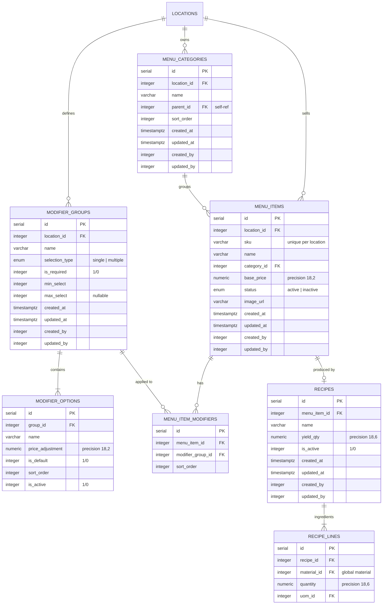

# ERD: Menu

Menu Items, Categories, Modifier Groups, Recipes. All **per-location**.

## Mermaid



## Diagram

```
[menu_categories]
  PK id serial
  FK location_id ────── locations (CASCADE)
  -- name varchar(255)
  FK parent_id - - → self (self-ref)
  -- sort_order integer, default 0
  -- audit stamps
  IDX (location_id)
  IDX (parent_id)


[menu_items]
  PK id serial
  FK location_id ────── locations (CASCADE)
  UK (location_id, sku)
  -- sku varchar(100)
  -- name varchar(255)
  FK category_id - - → menu_categories (SET NULL)
  -- base_price numeric(18,2)
  -- status enum (active/inactive)
  -- image_url varchar(500)
  -- audit stamps
  IDX (location_id)
  IDX (category_id)


[modifier_groups]                [modifier_options]
  PK id serial                     PK id serial
  FK location_id ── locations      FK group_id ────── modifier_groups
       (CASCADE)                        (CASCADE)
  -- name varchar(255)             -- name varchar(255)
  -- selection_type enum (single/  -- price_adjustment numeric(18,2)
       multiple)                        default '0'
  -- is_required integer (1/0)     -- is_default integer (1/0)
  -- min_select integer, default 0 -- sort_order integer, default 0
  -- max_select integer nullable   -- is_active integer (1/0)
  -- audit stamps                  IDX (group_id)
  IDX (location_id)


[menu_item_modifiers]
  PK id serial
  FK menu_item_id ────── menu_items (CASCADE)
  FK modifier_group_id ── modifier_groups (CASCADE)
  -- sort_order integer, default 0
  UK (menu_item_id, modifier_group_id)
  IDX (menu_item_id)
  IDX (modifier_group_id)


[recipes]                        [recipe_lines]
  PK id serial                     PK id serial
  FK menu_item_id ── menu_items    FK recipe_id ────── recipes (CASCADE)
       (CASCADE)                   FK material_id ──── materials (RESTRICT)
  -- name varchar(255)             -- quantity numeric(18,6)
  -- yield_qty numeric(18,6)       FK uom_id ────────── uoms (RESTRICT)
  -- is_active integer (1/0)       CHECK quantity > 0
  -- audit stamps                  IDX (recipe_id)
  UK (menu_item_id) WHERE            IDX (material_id)
       is_active = 1                 IDX (uom_id)
  IDX (menu_item_id)
```

## Notes

- Menu items scoped to location. SKU unique within a location via composite unique index.
- Modifier groups are per-location, reusable across items in same location.
- `menu_item_modifiers` is the M:N join between items and groups.
- `modifier_options` has no audit stamps — lightweight child table.
- Recipes reference global materials (enabling cross-location cost analysis).
- One active recipe per menu item — enforced via partial unique index `WHERE is_active = 1`.
- `recipe_lines.quantity` has CHECK > 0 constraint.
- `menu_item_status` and `selection_type` are pg enums.

---

**Next:** [pos.md](./pos.md) — Orders, Payments, Shifts.
