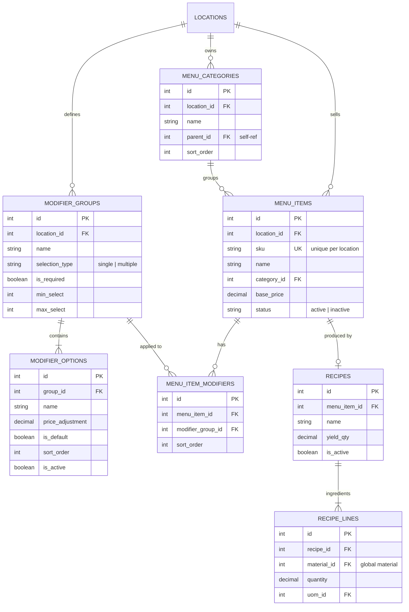

# ERD: Menu

Menu Items, Categories, Modifier Groups, Recipes. All **per-location**.

## Mermaid



[Open/Edit diagram](https://l.mermaid.ai/5FIXPR)

## Diagram

```
[menu_categories]
  PK id
  FK location_id ────── locations
  -- name
  FK parent_id - - → self
  -- sort_order


[menu_items]
  PK id
  FK location_id ────── locations
  UK (location_id, sku)
  -- sku
  -- name
  FK category_id - - → menu_categories
  -- base_price numeric(18,2)
  -- status (active/inactive)
  -- image_url
  -- audit stamps


[modifier_groups]                [modifier_options]
  PK id                            PK id
  FK location_id ── locations      FK group_id ────── modifier_groups
  -- name                          -- name
  -- selection_type (single/       -- price_adjustment numeric(18,2)
       multiple)                   -- is_default
  -- is_required                   -- sort_order
  -- min_select                    -- is_active
  -- max_select


[menu_item_modifiers]
  PK id
  FK menu_item_id ────── menu_items
  FK modifier_group_id ── modifier_groups
  -- sort_order
  UK (menu_item_id, modifier_group_id)


[recipes]                        [recipe_lines]
  PK id                            PK id
  FK menu_item_id ── menu_items    FK recipe_id ────── recipes
  -- name                          FK material_id ──── materials (global)
  -- yield_qty numeric(18,6)       -- quantity numeric(18,6)
  -- is_active                     FK uom_id ────────── uoms
  -- audit stamps
```

## Notes

- Menu items scoped to location. SKU unique within a location.
- Modifier groups are per-location, reusable across items in same location.
- `menu_item_modifiers` is the M:N join between items and groups.
- Recipes reference global materials (enabling cross-location cost analysis).
- One active recipe per menu item (Phase 1).

---

**Next:** [pos.md](./pos.md) — Orders, Payments, Shifts.
