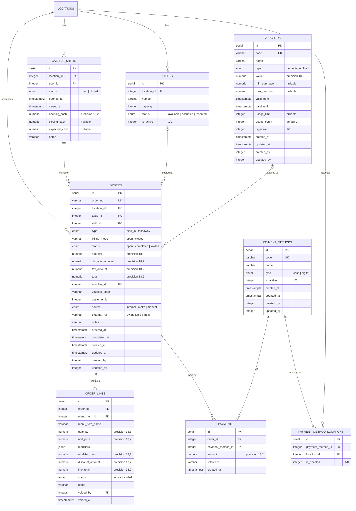

# ERD: POS

Orders, Payments, Cashier Shifts, Tables, Vouchers.

## Mermaid



## Diagram

```
[payment_methods]                [payment_method_locations]
  PK id serial                     PK id serial
  UK code varchar(50)              FK payment_method_id ── payment_methods
  -- name varchar(255)                  (CASCADE)
  -- type enum (cash/digital)      FK location_id ──────── locations
  -- is_active integer (1/0)            (CASCADE)
  -- audit stamps                  -- is_enabled integer (1/0), default 1
                                   UK (payment_method_id, location_id)
                                   IDX (payment_method_id)
                                   IDX (location_id)


[tables]
  PK id serial
  FK location_id ────── locations (CASCADE)
  UK (location_id, number)
  -- number varchar(50)
  -- capacity integer, default 4
  -- status enum (available/occupied/reserved)
  -- is_active integer (1/0), default 1
  IDX (location_id)


[cashier_shifts]
  PK id serial
  FK location_id ────── locations (CASCADE)
  FK user_id ────────── users (RESTRICT)
  -- status enum (open/closed)
  -- opened_at timestamptz, default now()
  -- closed_at timestamptz nullable
  -- opening_cash numeric(18,2), default '0'
  -- closing_cash numeric(18,2) nullable
  -- expected_cash numeric(18,2) nullable
  -- notes varchar(1000)
  IDX (location_id)
  IDX (user_id)


[orders]
  PK id serial
  UK order_no varchar(100)
  FK location_id ────── locations (RESTRICT)
  FK table_id - - - → tables (SET NULL)
  FK shift_id ─────── cashier_shifts (RESTRICT)
  -- type enum (dine_in/takeaway)
  -- billing_mode varchar(20), default 'open'
  -- status enum (open/completed/voided)
  -- subtotal numeric(18,2), default '0'
  -- discount_amount numeric(18,2), default '0'
  -- tax_amount numeric(18,2), default '0'
  -- total numeric(18,2), default '0'
  FK voucher_id - - → vouchers (SET NULL)
  -- voucher_code varchar(50) nullable
  -- customer_id integer nullable
  -- source enum (internal/moka/manual)
  -- external_ref varchar(255)
  UK external_ref WHERE NOT NULL (partial)
  -- notes varchar(1000)
  -- ordered_at timestamptz, default now()
  -- completed_at timestamptz nullable
  -- audit stamps
  IDX (location_id, status, ordered_at)
  IDX (table_id)
  IDX (shift_id)
  IDX (voucher_id)


[order_lines]
  PK id serial
  FK order_id ────── orders (CASCADE)
  FK menu_item_id ── menu_items (RESTRICT)
  -- menu_item_name varchar(255) (snapshot)
  -- quantity numeric(18,6)
  -- unit_price numeric(18,2)
  -- modifiers jsonb nullable
  -- modifier_total numeric(18,2), default '0'
  -- discount_amount numeric(18,2), default '0'
  -- line_total numeric(18,2)
  -- status enum (active/voided)
  -- notes varchar(500)
  FK voided_by - - → users (SET NULL)
  -- voided_at timestamptz nullable
  IDX (order_id)
  IDX (menu_item_id)


[payments]
  PK id serial
  FK order_id ────────── orders (CASCADE)
  FK payment_method_id ── payment_methods (RESTRICT)
  -- amount numeric(18,2)
  -- reference varchar(255) nullable
  -- created_at timestamptz, default now()
  IDX (order_id)
  IDX (payment_method_id)


[vouchers]
  PK id serial
  UK code varchar(50)
  -- name varchar(255)
  -- type enum (percentage/fixed)
  -- value numeric(18,2)
  -- min_purchase numeric(18,2) nullable
  -- max_discount numeric(18,2) nullable
  -- valid_from timestamptz
  -- valid_until timestamptz
  -- usage_limit integer nullable
  -- usage_count integer, default 0
  -- is_active integer (1/0), default 1
  -- audit stamps
  IDX (is_active)
```

## Notes

- `orders.billing_mode` is **varchar(20)**, not a pg enum. Values: `open`, `closed`.
- `orders.status`, `orders.type`, `orders.source` are pg enums.
- `orders.voucher_id` and `voucher_code` link the applied voucher to the order.
- `orders.external_ref` has a partial unique index (`WHERE external_ref IS NOT NULL`) — prevents duplicate Moka imports.
- `order_lines.modifiers` stores modifier selections as JSON (denormalized for history).
- `order_lines.menu_item_name` + `unit_price` are snapshots (don't change if menu updates).
- `payment_method_locations` controls which methods are available per store.
- `tables.is_active` allows soft-deleting tables. Table status auto-updates via application logic on order lifecycle.
- `cashier_shifts` has no audit stamps — uses explicit `opened_at`/`closed_at` instead.
- `vouchers.usage_count` incremented atomically when a voucher is applied to a completed order.
- One voucher per order max. Validation checks: active, date range, usage limit, min purchase.

---

**Next:** [inventory.md](./inventory.md) — Stock, Transfers, Opname.
