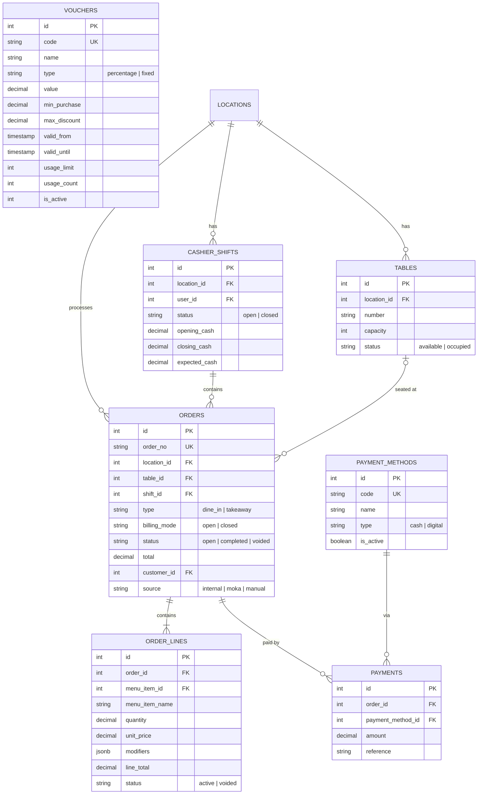

# ERD: POS

Orders, Payments, Cashier Shifts, Tables, Vouchers.

## Mermaid



[Open/Edit diagram](https://l.mermaid.ai/AcIKao)

## Diagram

```
[tables]
  PK id
  FK location_id ────── locations
  UK (location_id, number)
  -- number
  -- capacity
  -- status (available/occupied/reserved)
  -- is_active


[cashier_shifts]
  PK id
  FK location_id ────── locations
  FK user_id ────────── users
  -- status (open/closed)
  -- opened_at, closed_at
  -- opening_cash, closing_cash, expected_cash numeric(18,2)
  -- notes


[orders]
  PK id
  UK order_no
  FK location_id ────── locations
  FK table_id - - - → tables
  FK shift_id ─────── cashier_shifts
  -- type (dine_in/takeaway)
  -- billing_mode (open/closed)
  -- status (open/completed/voided)
  -- subtotal, discount_amount, tax_amount, total numeric(18,2)
  FK customer_id - - → customers
  -- source (internal/moka/manual)
  -- external_ref UK nullable
  -- notes
  -- ordered_at, completed_at
  -- audit stamps


[order_lines]
  PK id
  FK order_id ────── orders (CASCADE)
  FK menu_item_id ── menu_items
  -- menu_item_name (snapshot)
  -- quantity numeric(18,6)
  -- unit_price numeric(18,2)
  -- modifiers jsonb
  -- modifier_total numeric(18,2)
  -- discount_amount numeric(18,2)
  -- line_total numeric(18,2)
  -- status (active/voided)
  -- notes
  FK voided_by - - → users
  -- voided_at


[payment_methods]
  PK id
  UK code
  -- name
  -- type (cash/digital)
  -- is_active


[payment_method_locations]
  PK id
  FK payment_method_id ── payment_methods
  FK location_id ──────── locations
  -- is_enabled
  UK (payment_method_id, location_id)


[payments]
  PK id
  FK order_id ────────── orders (CASCADE)
  FK payment_method_id ── payment_methods
  -- amount numeric(18,2)
  -- reference
  -- created_at


[vouchers]
  PK id
  UK code
  -- name
  -- type (percentage/fixed)
  -- value numeric(18,2)
  -- min_purchase numeric(18,2) nullable
  -- max_discount numeric(18,2) nullable
  -- valid_from timestamptz
  -- valid_until timestamptz
  -- usage_limit nullable
  -- usage_count (default 0)
  -- is_active
  -- audit stamps
```

## Notes

- `order_lines.modifiers` stores modifier selections as JSON (denormalized for history).
- `order_lines.menu_item_name` + `unit_price` are snapshots (don't change if menu updates).
- `payment_method_locations` controls which methods are available per store.
- `orders.external_ref` unique constraint prevents duplicate Moka imports.
- Table status auto-updates via application logic on order lifecycle.
- `vouchers.usage_count` incremented atomically when a voucher is applied to a completed order.
- One voucher per order max. Validation checks: active, date range, usage limit, min purchase.

---

**Next:** [inventory.md](./inventory.md) — Stock, Transfers, Opname.
