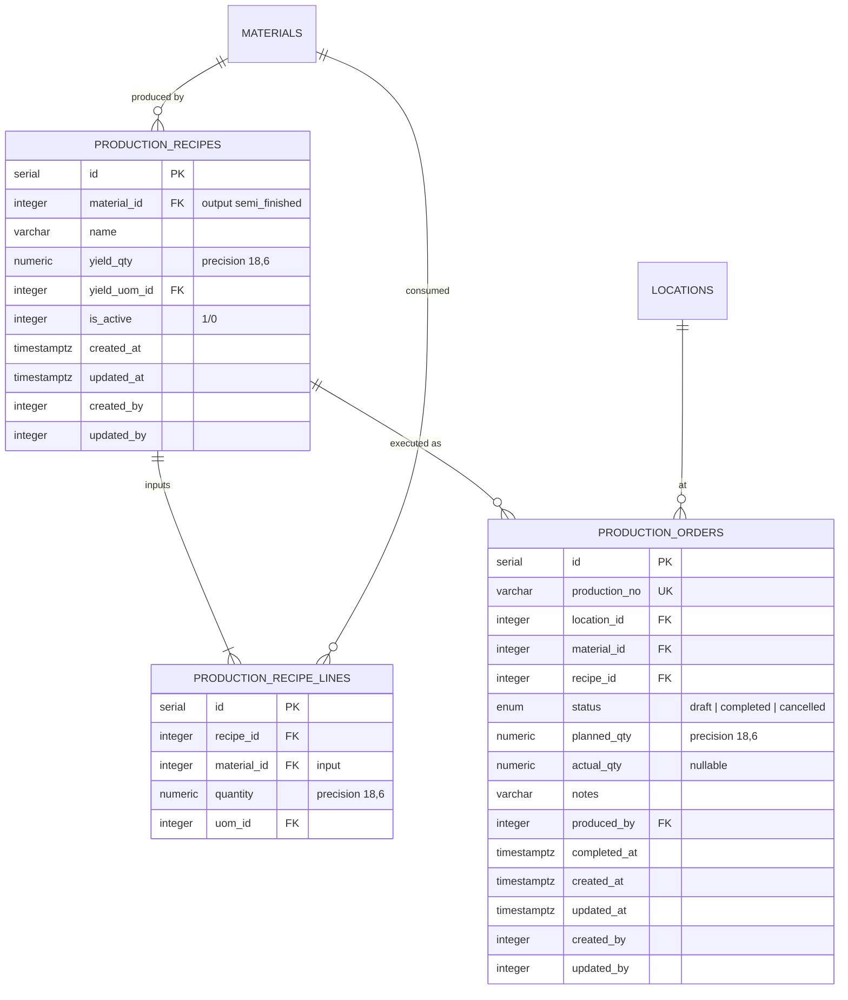

# ERD: Production

Production Recipes, Recipe Lines, Production Orders. Converts raw materials into semi-finished goods.

## Mermaid



## Diagram

```
[production_recipes]             [production_recipe_lines]
  PK id serial                     PK id serial
  FK material_id ── materials      FK recipe_id ── production_recipes
       (RESTRICT, output)               (CASCADE)
  -- name varchar(255)             FK material_id ── materials (RESTRICT,
  -- yield_qty numeric(18,6)            input)
  FK yield_uom_id ── uoms          -- quantity numeric(18,6)
       (RESTRICT)                  FK uom_id ── uoms (RESTRICT)
  -- is_active integer (1/0)       CHECK quantity > 0
  -- audit stamps                  IDX (recipe_id)
  UK (material_id) WHERE           IDX (material_id)
       is_active = 1               IDX (uom_id)
  IDX (material_id)
  IDX (yield_uom_id)


[production_orders]
  PK id serial
  UK production_no varchar(100)
  FK location_id ────── locations (RESTRICT)
  FK material_id ────── materials (RESTRICT)
  FK recipe_id ──────── production_recipes (RESTRICT)
  -- status enum (draft/completed/cancelled)
  -- planned_qty numeric(18,6)
  -- actual_qty numeric(18,6) nullable
  -- notes varchar(1000)
  FK produced_by - - → users (SET NULL)
  -- completed_at timestamptz nullable
  -- audit stamps
  CHECK planned_qty > 0
  IDX (location_id)
  IDX (material_id)
  IDX (recipe_id)
  IDX (produced_by)
```

## Notes

- Production is a **separate schema** from inventory (own schema file: `production.ts`).
- `production_recipes` outputs a semi-finished material. One active recipe per material — enforced via partial unique index `WHERE is_active = 1`.
- `production_recipe_lines` define the input materials consumed. CHECK `quantity > 0`.
- `production_orders` track planned vs actual yield. `completedAt` is set when status changes to `completed`.
- `production_order_status` is a pg enum: `draft`, `completed`, `cancelled`.
- Production completion triggers stock movements: `production_out` for consumed inputs, `production_in` for produced output.
- `planned_qty` must be positive (CHECK constraint).

---

**Next:** [finance.md](./finance.md) — CoA, Journals, AP (future).
